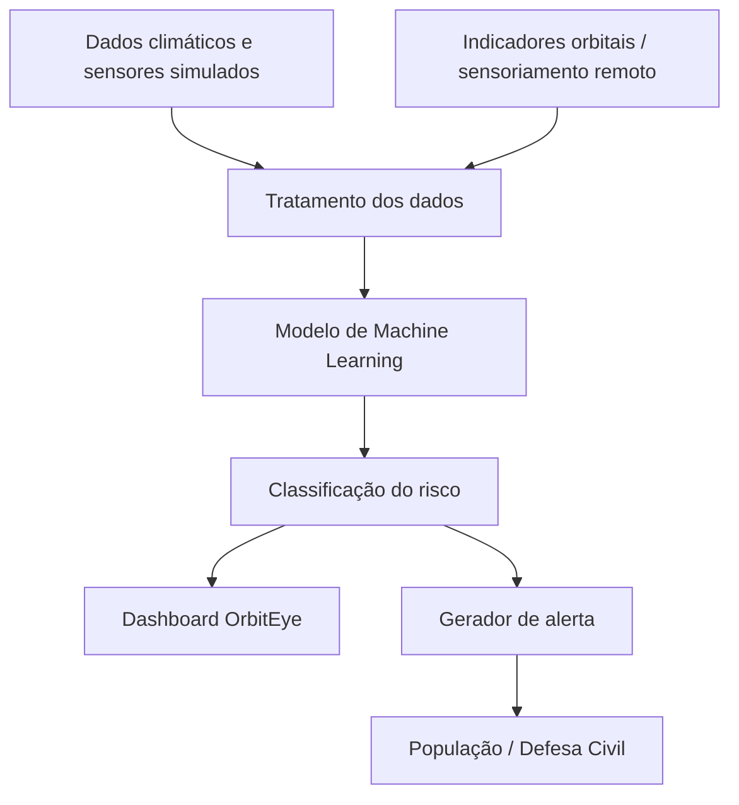

# OrbitEye AI

O **OrbitEye AI** é um módulo de inteligência climática desenvolvido para a Global Solution FIAP. A proposta é apoiar cidades, Defesa Civil e população no monitoramento de áreas vulneráveis a enchentes, deslizamentos e outros eventos climáticos extremos.

O sistema usa dados ambientais, sensores simulados e indicadores associados a sensoriamento remoto para classificar o risco de uma região como **baixo, médio, alto ou crítico**.

## Problema

Eventos climáticos extremos estão cada vez mais frequentes e afetam diretamente a população urbana. Em muitos casos, o problema não é a falta de dados, mas a dificuldade de transformar dados técnicos em informação clara, rápida e útil.

O OrbitEye foi pensado para reduzir esse intervalo entre a coleta de dados e a tomada de decisão.

## Solução

A solução analisa dados como chuva acumulada, umidade, temperatura, velocidade do vento, nível do rio, índice de vegetação/satélite e histórico de ocorrências da região.

A partir desses indicadores, o modelo de Machine Learning classifica o risco climático e o dashboard apresenta o resultado de forma visual. Além disso, o sistema gera um alerta em linguagem simples para facilitar a comunicação com moradores e equipes de resposta.

## Relação com a Global Solution

O projeto se conecta ao tema da economia espacial ao utilizar o conceito de dados orbitais e sensoriamento remoto como apoio à análise climática. O índice de vegetação utilizado no modelo representa uma variável derivada de observação da Terra, comum em aplicações que usam imagens de satélite.

## Tecnologias utilizadas

- Python
- Pandas
- Scikit-Learn
- Random Forest
- Streamlit
- Plotly
- OpenAI API opcional
- Dataset CSV

## Arquitetura



## Como executar

```bash
py -3.12 -m pip install -r requirements.txt
py -3.12 src\train_model.py
py -3.12 -m streamlit run src\app.py
```

## Exemplo de previsão

```json
{
  "chuva_mm": 150,
  "umidade": 95,
  "temperatura": 26,
  "vento_kmh": 70,
  "nivel_rio_m": 6.5,
  "indice_vegetacao": 0.10,
  "historico_ocorrencias": 12
}
```

Resultado esperado:

```text
Risco previsto: CRITICO
```

## Vídeo de demonstração

O vídeo deve mostrar o problema, a proposta do OrbitEye, o treinamento do modelo, o dashboard, a simulação de risco crítico e o alerta gerado automaticamente.
