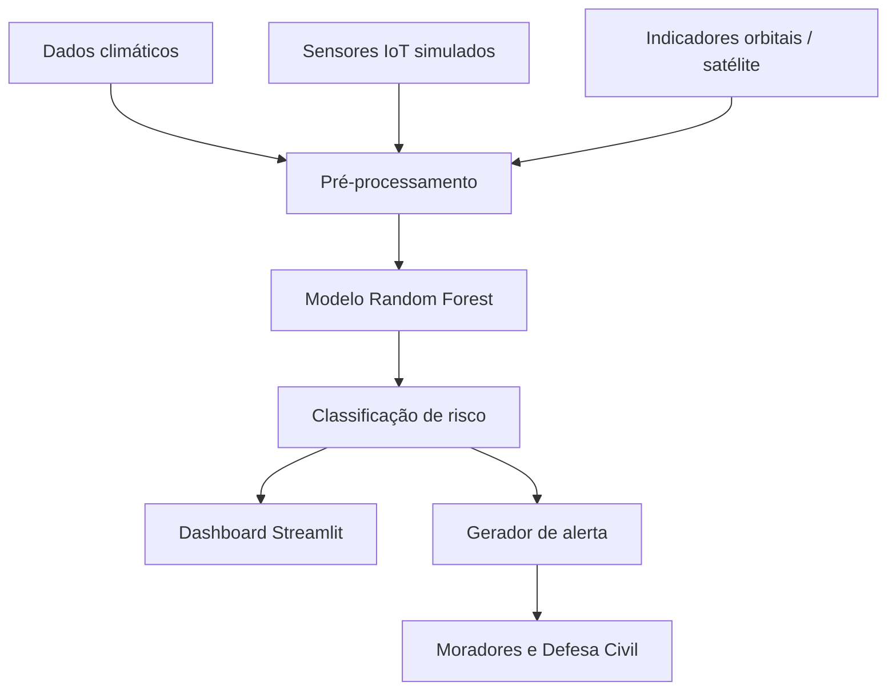

# Arquitetura OrbitEye AI

```mermaid
flowchart TD
    A[Dados climáticos] --> B[Pré-processamento]
    C[Sensores IoT simulados] --> B
    D[Indicadores orbitais / satélite] --> B
    B --> E[Modelo Random Forest]
    E --> F[Classificação de risco]
    F --> G[Dashboard Streamlit]
    F --> H[Gerador de alerta]
    H --> I[Moradores e Defesa Civil]
```
